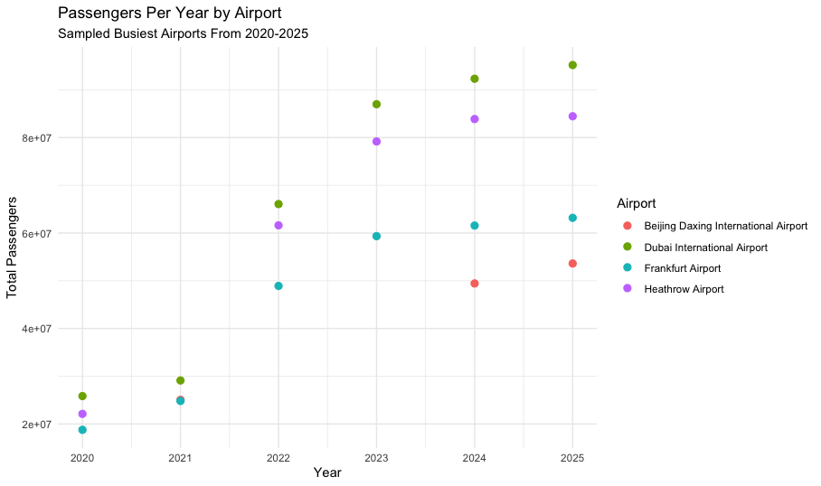

## Busiest Airports Analysis

The following section will be reviewing the busiest airports in the world. The is pulled from wikipedia, and the goal was to compare the top five busiest airports from 2020-2025. Below is a graphic comparing each year's busiest airports.

 

This scatter plot shows the count of passengers per year bet